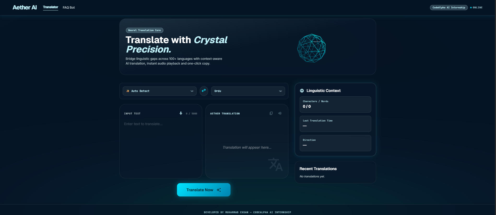
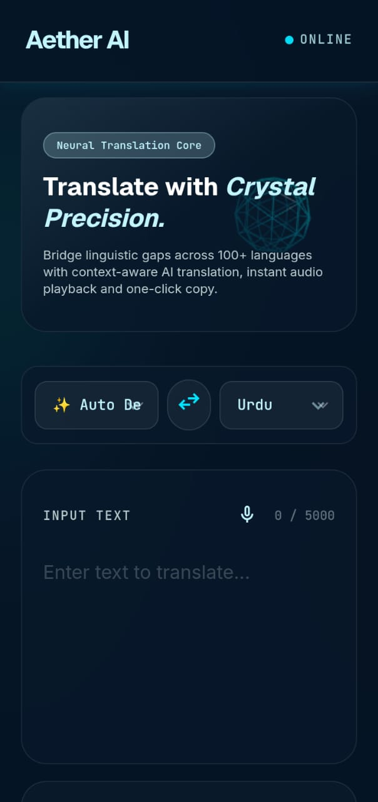

# 🌐 Language Translation Tool

[](https://ehsantranslator.pythonanywhere.com)
[](https://python.org)
[](https://flask.palletsprojects.com)

A professional AI-powered language translation web app built for the **CodeAlpha Artificial Intelligence Internship**.

## ✨ Features

- Translate text between **100+ languages**
- **Auto-detect** source language
- Clean, modern **Streamlit web UI**
- **Copy button** on the translated output
- **Text-to-Speech** — listen to the translated text (gTTS)
- One-click **language swap**

## 🛠️ Tech Stack

| Component | Technology |
|-----------|------------|
| UI | Streamlit |
| Translation Engine | Google Translate (via `deep-translator`) |
| Text-to-Speech | gTTS (Google Text-to-Speech) |
| Language | Python 3 |

## 🚀 How to Run

```bash
# 1. Install dependencies
pip install -r requirements.txt

# 2. Run the app (Crystal Blue web UI)
python web_app.py
```

Then open **http://localhost:5000** in your browser.

The UI features an animated WebGL crystal-blue shader background, a floating 3D crystal (Three.js), glassmorphism cards, live translation stats, and recent-translation history.

> A simpler Streamlit version is also included: `streamlit run app.py`

## 📸 Screenshots

| Desktop | Mobile |
|---------|--------|
|  |  |

## 📖 How It Works

1. User enters text and selects source & target languages.
2. The text is sent to the Google Translate engine through the `deep-translator` library.
3. The translated response is displayed clearly on screen with a copy button.
4. Optionally, the user can listen to the translation using text-to-speech.

## 📸 Demo

Run the app and try translating between English, Urdu, French, Arabic, and more!

---

*CodeAlpha AI Internship — Task 1 | Repository: `CodeAlpha_LanguageTranslationTool`*
